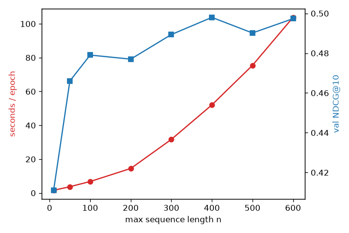

# sasrec-longseq: efficiency and longer sequences for SASRec

An efficiency-focused extension of [SASRec](https://arxiv.org/abs/1808.09781), built on top of
the faithful reproduction in [`sasrec-pytorch`](https://github.com/DoodlingAWorld/sasrec-pytorch).
Sequential recommenders are moving toward feeding longer and longer user histories, so this repo
studies the cost side of that: how training scales with sequence length, how to feed data faster,
and how the choice of training objective trades quality for compute.

## What's here

1. **Vectorized negative sampling** (`sampling.py`): replaces SASRec's per-position Python
   sampling loop with a batched tensor implementation, and measures the speedup.
2. **Full-softmax vs sampled-BCE loss** (`losses_full.py`): the exact next-item objective vs the
   one-negative approximation, compared on quality, speed, and memory.
3. **Sequence-length scaling** (`scaling.py`): reproduces the paper's Table V (cost grows with the
   max length `n`; quality saturates around `n = 500`).
4. **Throughput profiling** (`profiling.py`): items/second for the data path and the training step.

The SASRec model, data pipeline, baseline loss, and evaluation are vendored under
`src/sasrec_longseq/core/` from the sibling repo so this project clones and runs standalone.

## Results

Measured on CPU with MovieLens-1M (model: d=50, b=2). Epoch counts are kept modest for a
CPU budget, so absolute NDCG is below the full 300-epoch reproduction; the comparisons are
apples-to-apples within each study.

### 1. Vectorized vs loop negative sampling

| Negative sampling | items / sec |
|---|---|
| Per-position Python loop (Phase 1) | 422,712 |
| Vectorized tensor ops | 31,381,565 |
| **Speedup** | **74.2x** |

Replacing the per-(user, step) Python loop with batched tensor ops is the canonical "feed
data faster" win. For reference, forward+backward on the same machine runs at ~45K items/sec.

### 2. Sampled-BCE vs full-softmax loss (20 epochs, n=200)

| Loss | sec / epoch | val NDCG@10 | val Hit@10 |
|---|---|---|---|
| sampled-BCE (1 negative) | 14.1 | 0.5414 | 0.7987 |
| full-softmax (all items) | 43.0 | **0.5862** | **0.8123** |

The exact objective wins on quality (+0.045 NDCG@10) but costs ~3x per epoch, because its
logits tensor is `[B, L, |I|+1]`. This is precisely the tradeoff that motivates sampled losses
on large catalogs.

### 3. Sequence-length scaling (Table V, 12 epochs)



| n | sec/epoch | val NDCG@10 |
|---|---|---|
| 10 | 1.6 | 0.4111 |
| 50 | 3.7 | 0.4660 |
| 100 | 6.8 | 0.4791 |
| 200 | 14.5 | 0.4770 |
| 300 | 31.7 | 0.4894 |
| 400 | 52.1 | 0.4980 |
| 500 | 75.5 | 0.4902 |
| 600 | 103.8 | 0.4973 |

Cost grows super-linearly with the max sequence length (the O(n^2) self-attention term),
while NDCG improves then plateaus around n≈300-400. The paper's headline holds: there are
diminishing returns to ever-longer sequences, so the useful length is dataset-dependent.

## Quickstart

```bash
python -m venv .venv && source .venv/bin/activate
pip install torch --index-url https://download.pytorch.org/whl/cpu
pip install -r requirements.txt

pytest                                   # component specs (fail until implemented)
python scripts/run_scaling.py            # Table V sweep + plot
python scripts/compare_losses.py         # loss comparison
python scripts/profile_throughput.py     # sampler + step throughput
```

If your network needs an HTTP proxy to reach the internet, pass it to `download_ml1m(proxy=...)`.

## Layout

```
src/sasrec_longseq/
  core/             vendored SASRec (model, data, baseline loss, eval) from sasrec-pytorch
  sampling.py       vectorized negative sampling
  losses_full.py    full-vocabulary softmax loss
  scaling.py        sequence-length scaling harness (Table V)
  profiling.py      throughput profiler
scripts/            run_scaling.py, compare_losses.py, profile_throughput.py
tests/              one spec file per component
```

## License

MIT. Builds on SASRec (Kang & McAuley, ICDM 2018).
